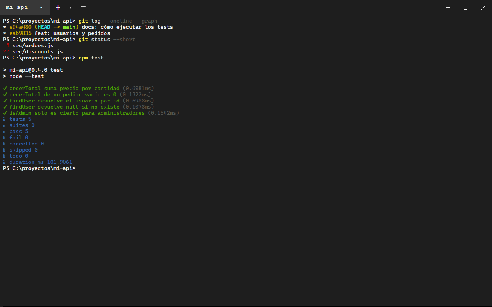
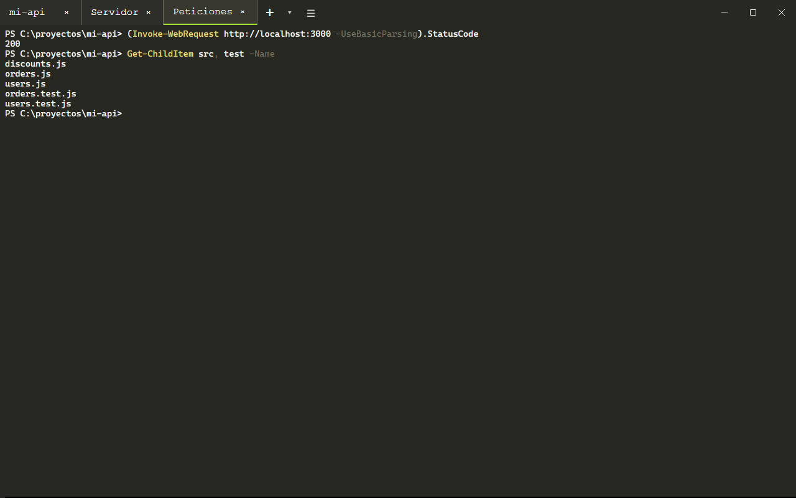
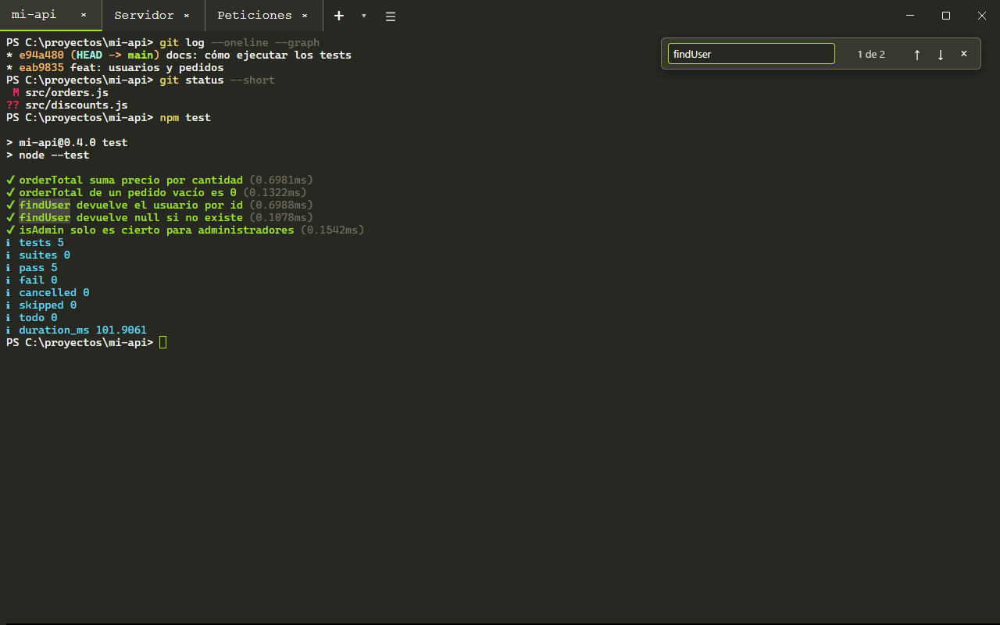
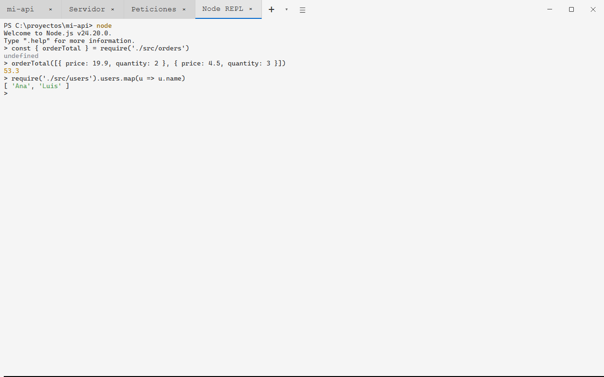
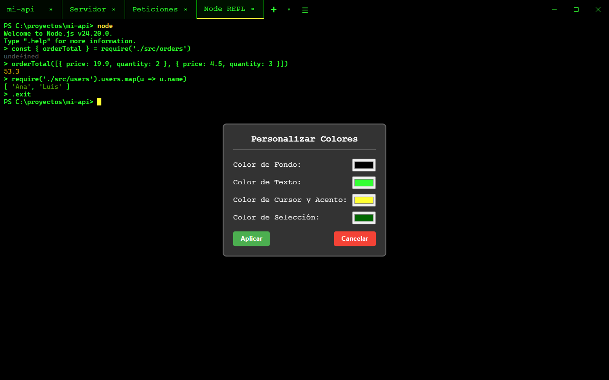

# HYPE Terminal

Terminal de escritorio para Windows, macOS y Linux con pestañas, temas y búsqueda. Por dentro, cada pestaña es una
shell real en una pseudo-terminal: PowerShell, cmd, Git Bash o WSL en Windows y tu shell en macOS y Linux, con colores,
autocompletado y programas interactivos.

**Web y descargas:** https://cmurestudillos.github.io/hype-terminal/



## Características

- **Una shell de verdad**: pseudo-terminal por pestaña ([node-pty](https://github.com/microsoft/node-pty), ConPTY en
  Windows) renderizada con [xterm.js](https://xtermjs.org/). Colores ANSI, programas interactivos (`node`, `python`,
  `vim`…) y sesión persistente entre comandos.
- **La shell que prefieras**: detecta Windows PowerShell, PowerShell 7, cmd, Git Bash y WSL (si tiene distribuciones)
  en Windows, y zsh, bash y fish en macOS/Linux. Botón **▾** o _Archivo › Nueva Pestaña con_, y _Shell por Defecto_.
- **Pestañas con nombre**: el título sigue al directorio actual; doble clic o `F2` para ponerle un nombre propio.
- **Restaurar pestañas**: al volver a abrirla recupera shell, nombre y directorio de cada pestaña (desactivable).
- **Cierres seguros**: `Ctrl+C` interrumpe el comando en curso y cerrar una pestaña o la ventana con algo en marcha
  pide confirmación. Al cerrar se terminan también los procesos hijos.
- **Búsqueda** en la salida con `Ctrl+F`, **enlaces** clicables con `Ctrl`+clic y **tamaño de texto** ajustable.
- **6 temas** (Oscuro, Claro, Monokai, Solarized, Retro, Hacker) y colores personalizables.
- **Barra de título integrada** como Windows Terminal: pestañas arriba, menú en el botón **☰** y botones nativos de la
  ventana con los colores del tema.

## Capturas

| Pestañas con nombre (Monokai)                        | Búsqueda con `Ctrl+F`                                |
| ---------------------------------------------------- | ---------------------------------------------------- |
|  |  |

| REPL de Node (tema Claro)                                  | Personalizar colores (Retro)                                 |
| ---------------------------------------------------------- | ------------------------------------------------------------ |
|  |  |

## Atajos de teclado

| Atajo                                | Acción                                                        |
| ------------------------------------ | ------------------------------------------------------------- |
| `Ctrl+T`                             | Nueva pestaña con la shell por defecto                        |
| `Ctrl+W`                             | Cerrar pestaña (también `exit`)                               |
| `Ctrl+Tab` / `Ctrl+Shift+Tab`        | Pestaña siguiente / anterior                                  |
| `F2` / doble clic                    | Renombrar pestaña (vacío = título automático)                 |
| `Ctrl+C`                             | Copiar si hay texto seleccionado; si no, interrumpir          |
| `Ctrl+V` / clic derecho              | Pegar (clic derecho con selección copia)                      |
| `Ctrl+F`                             | Buscar en la salida (`Enter` / `Mayús+Enter`, `Esc` cierra)   |
| `Ctrl+=` / `Ctrl+-` / `Ctrl+0`       | Aumentar / reducir / restablecer el texto                     |
| `Ctrl`+clic en una URL               | Abrirla en el navegador                                       |

En macOS se usa `Cmd` en lugar de `Ctrl`, salvo `Ctrl+Tab` para cambiar de pestaña y `Ctrl+C` para interrumpir.

## Requisitos

- [Node.js](https://nodejs.org/) 22.12+
- [pnpm](https://pnpm.io/) 11+
- En Linux, `python3`, `make` y `g++` para compilar `node-pty` durante `pnpm install` (en Windows y macOS se usan sus
  binarios precompilados).

## Desarrollo

```bash
git clone https://github.com/cmurestudillos/hype-terminal.git
cd hype-terminal
pnpm install

pnpm start           # ejecutar la aplicación
pnpm lint            # ESLint (pnpm lint:fix para corregir)
pnpm format          # Prettier

pnpm package:win     # instalador de Windows (.exe)
pnpm package:mac     # imagen de macOS (.dmg, Apple Silicon)
pnpm package:linux   # AppImage
```

Los instaladores se generan en `release/`. Para compilar sin intentar publicar:
`pnpm exec electron-builder --win --publish never`.

### Estructura

```
├── main.js        # proceso principal: ventana, menú, shells y una pseudo-terminal (node-pty) por pestaña
├── preload.js     # puente IPC seguro (contextIsolation)
├── renderer.js    # interfaz: pestañas, xterm.js, búsqueda, temas, restaurar sesión
├── index.html     # estructura de la ventana
├── styles.css     # temas mediante variables CSS
├── docs/          # web del proyecto (GitHub Pages)
└── .github/workflows/release.yml   # instaladores de Windows, macOS y Linux
```

## Web y capturas

La web está en `docs/` (HTML, CSS y JavaScript sin dependencias ni build) y se publica con GitHub Pages desde la rama
`master`, carpeta `/docs`. Las descargas se rellenan solas con la API de la última release publicada.

Las capturas de `docs/assets/screenshots/` son reales. Para regenerarlas se usa un script de Electron **fuera del repo**
que:

1. Crea un proyecto de ejemplo temporal (repo git, código y tests con `node --test`).
2. Carga el `main.js` real de la app y escribe los comandos dentro de la ventana (`webContents.sendInputEvent`), con un
   prompt sin rutas personales.
3. Captura **solo la ventana de la app** con `desktopCapturer` (incluye los botones nativos de la barra de título) a
   1280×800 y guarda los PNG en `docs/assets/screenshots/`.

Tras regenerarlas, comprueba la web en escritorio (claro/oscuro) y en móvil antes de hacer commit.

## Publicar una versión

Los instaladores los genera GitHub Actions (`.github/workflows/release.yml`) al subir un tag `vX.Y.Z`:

```bash
# 1. Subir la versión en package.json y hacer commit en develop
# 2. Crear el tag (debe coincidir con package.json; el workflow lo comprueba)
git tag -a v1.2.0 -m "v1.2.0"

# 3. Subir rama y tag (el tag lanza el workflow)
git push origin develop
git push origin v1.2.0
```

En unos 10 minutos aparece en _Actions_ el workflow **Release** con 4 jobs (borrador + Windows + macOS + Linux) y un
**borrador** de release con `HYPE-Terminal-Setup-X.Y.Z.exe`, `HYPE-Terminal-X.Y.Z-arm64.dmg` y
`HYPE-Terminal-X.Y.Z.AppImage`. Revísalo y pulsa **Publish release**: la web pasa sola a la nueva versión.

Si un build falla, corrige, borra el tag (`git tag -d vX.Y.Z && git push origin :refs/tags/vX.Y.Z`), vuelve a crearlo
sobre el commit bueno y súbelo.

Los instaladores no están firmados: Windows mostrará SmartScreen (_Más información → Ejecutar de todas formas_) y macOS
Gatekeeper (`xattr -cr "/Applications/HYPE Terminal.app"`).

## Contribuir

1. Haz fork del repositorio
2. Crea una rama para tu funcionalidad (`git checkout -b feature/amazing-feature`)
3. Haz commit de tus cambios (`git commit -m 'feat: add amazing feature'`)
4. Haz push a la rama (`git push origin feature/amazing-feature`)
5. Abre un Pull Request

## Licencia

Este proyecto está licenciado bajo la Licencia MIT.
